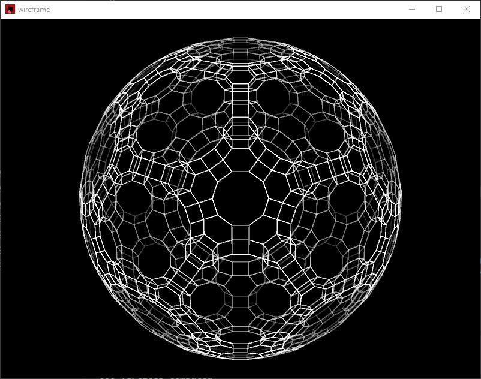

# Description

This program takes a [Coxeter matrix](https://en.wikipedia.org/wiki/Coxeter_group#Coxeter_matrix_and_Schl%C3%A4fli_matrix) 
and a list of nodes to ring in the corresponding [Coxeter-Dynkin diagram](https://polytope.miraheze.org/wiki/Coxeter_diagram). 
It generates from scratch, and then renders the corresponding polytope in any number of dimensions (within reason >_>).


This project was made for fun, and with plans to extend its capabilities, but has not been worked on in a while.
For this reason, the implementation is pretty slow. It caches generated vertex data to help with this somewhat.


# Usage

Polytope selection is done in main.rs itself, and thus the program needs to be recompiled
when changing shapes. There's not a particularly good reason for this :P

`cargo run --release`

# Controls

Click and drag to rotate shape. Hold down number keys to change which plane of rotation is being used.

Holding down a number key and pressing the up and down arrow keys adds a constant rotation speed.

```
Scroll: (perspective) zoom
Scroll + lctrl: orthographic zoom / scaling
Scroll + lshift: change line width
Q/A: increase/decrease near fade distance
W/S: increase/decrease far fade distance
E/D: increase/decreae off-volume fade distance
```
